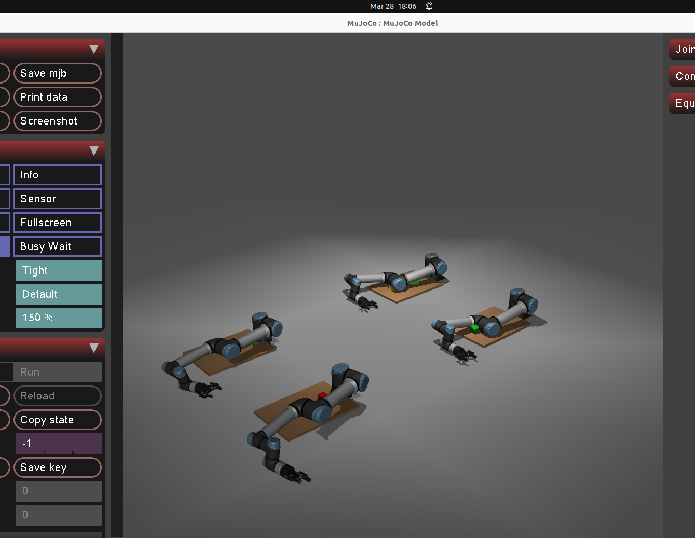

# mujoco-ur-arm-rl

Reinforcement learning training environment for the Universal Robots UR5e arm using MuJoCo, with a Robotiq 2F-85 gripper and graspable objects.


## Overview

- **Robot**: UR5e + Robotiq 2F-85 gripper
- **Task**: Reach / pick-and-place / cooperative handover
- **Algorithm**: SAC (Stable-Baselines3)
- **Simulator**: MuJoCo 3.x

## Environments

| Env | Task | Arms |
|-----|------|------|
| `URReachEnv` | Move end-effector to target | 1 |
| `URPickPlaceEnv` | Pick box and place at target | 1 |
| `URDualArmEnv` | Symmetric multi-arm pick / lift / place | 4+ even |

## Multi-Arm Training



Four or more UR5e arms with Robotiq 2F-85 grippers arranged symmetrically. Each arm gets its own table, object, and drop zone, and the layout can scale to 8 arms in the same pattern.

```bash
python3 train_dual_arm_live.py --arms 8 --n-envs 2
```

## Setup

```bash
pip install mujoco gymnasium stable-baselines3
```

Clone [MuJoCo Menagerie](https://github.com/google-deepmind/mujoco_menagerie) to `/home/asimov/mujoco_menagerie`.

## Train

```bash
# Single arm reach
python train.py

# Single arm pick-and-place
python train_pick_place.py

# Multi-arm training, headless by default
python3 train_dual_arm_live.py --arms 8 --n-envs 2

# Same trainer, but with the MuJoCo viewer
python3 train_dual_arm_live.py --arms 4 --n-envs 2 --viewer
```

Best models and checkpoints are saved under `models/multi_arm/`, run logs under `logs/multi_arm/`.

## Monitor Progress

```bash
# Find the newest run directory
cat logs/multi_arm/latest_run.txt

# Watch the live console log
tail -f logs/multi_arm/<run_name>.out

# Check the latest heartbeat
cat logs/multi_arm/<run_name>/latest_status.json
```

Useful signals:
- `timesteps`: training is advancing
- `ep_rew_mean`: average training reward per finished episode
- `eval_mean_reward`: evaluation reward from the latest eval pass
- `fps`: simulation throughput

## Visualize

```bash
python ur5e_with_gripper.py
```
